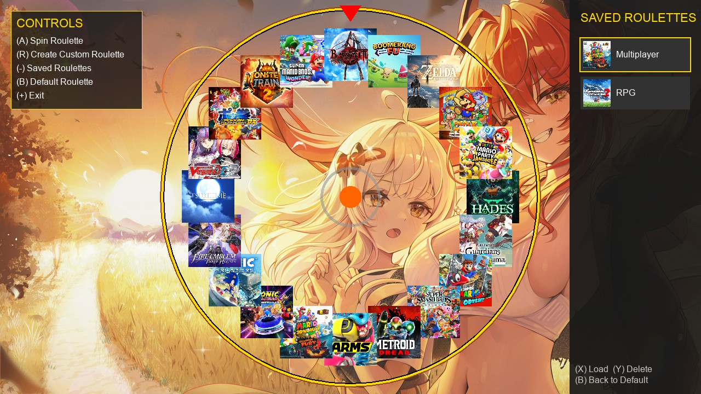

# 🎡 Red Roulette

**Red Roulette** is a polished, homebrew application for the Nintendo Switch. It helps you decide what to play next by randomly picking a game from your installed library. It features smooth physics, custom background/font support, and the ability to build and save custom roulette wheels.

## 🎮 Controls
| Button | Action |
| :---: | :--- |
| **(A)** | Spin the Roulette! |
| **(B)** | Re-roll a new default random Roulette |
| **(-)** | Open the "Saved Roulettes" sidebar |
| **(R)** | Open the "Create Custom Roulette" grid |
| **(+)** | Exit the application |
| **🕹️ Left Stick / D-Pad** | Navigate all menus and selection grids |

### 🛠️ In Menus:
| Button | Action |
| :---: | :--- |
| **(X)** | **[Sidebar]** Load selected Roulette / **[Grid]** Save Custom Roulette |
| **(Y)** | **[Sidebar]** Delete selected Roulette |
| **(B)** | **[Sidebar/Grid]** Close menu / Cancel |

## 📸 Screenshot

  

## 📥 Installation
Download the **RedRoulette.nro** and place it in the `/switch/` folder on your SD card.

## 📂 Customization
If you want to change the background image:
* **Background:** Place a **`bg.jpg`** at `sdmc:/switch/bg.jpg`.